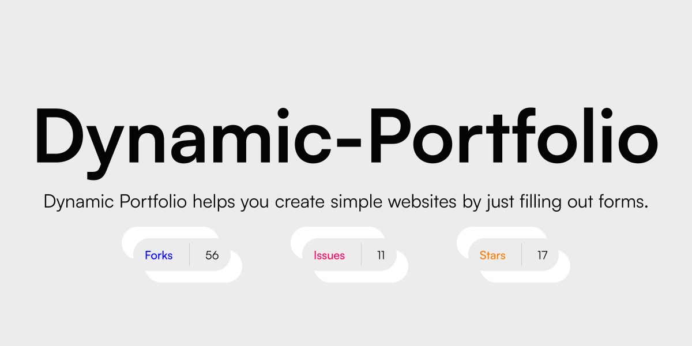
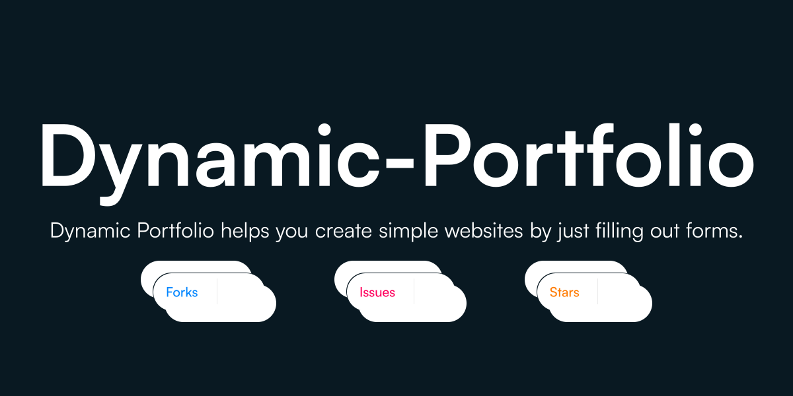
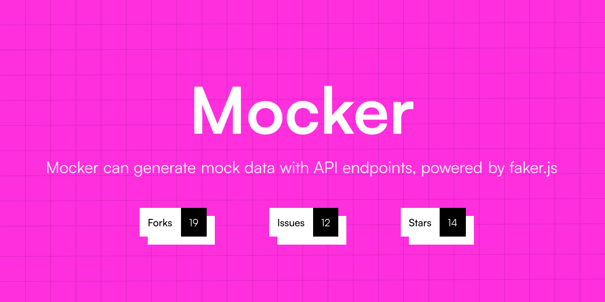

# Gitsnap

This is a [Next.js](https://nextjs.org/) project bootstrapped with [`create-next-app`](https://github.com/vercel/next.js/tree/canary/packages/create-next-app).

Gitsnap is designed to enhance the visual appeal of your GitHub repositories by effortlessly creating stunning banners.

It is to elevate the presentation of git projects with eye-catching banners that showcase the essence of your work, instantly capturing the attention of visitors and potential collaborators.

`🚧🚨 WORK IN PROGRESS 🚨🚧`

<b>Currently, there are two templates for users to play around.</b>

### Template 1




### Template 2




## Getting Started

First, run the development server:

```bash
npm run dev
# or
yarn dev
# or
pnpm dev
```

Open [http://localhost:3000](http://localhost:3000) with your browser to see the result.

## Learn More

To learn more about Next.js, take a look at the following resources:

- [Next.js Documentation](https://nextjs.org/docs) - learn about Next.js features and API.
- [Learn Next.js](https://nextjs.org/learn) - an interactive Next.js tutorial.

You can check out [the Next.js GitHub repository](https://github.com/vercel/next.js/) - your feedback and contributions are welcome!


Inspired from <a href="https://github.com/wei/socialify" target="_blank"> Socialify by Wei.</a>
